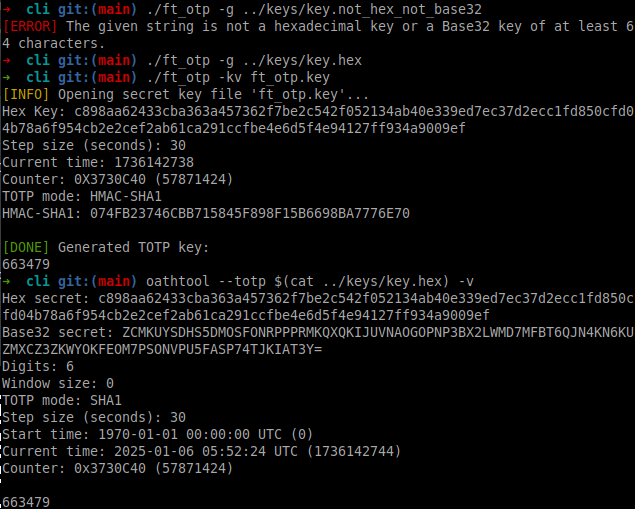
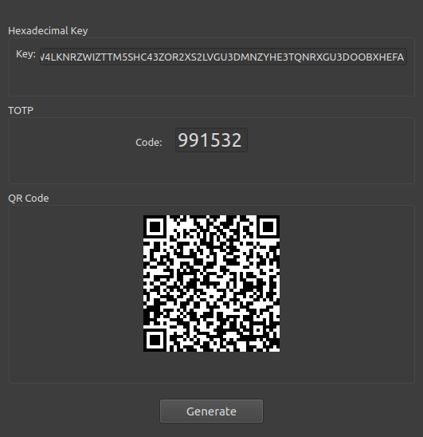

# ft_otp

## Description
This program allows you to securely store an initial password in an encrypted file and generate a new TOTP (Time-based One-Time Password) every time it is requested. It provides both a CLI (Command Line Interface) and a GUI (Graphical User Interface) version made with Qt Creator.

---

## Requirements
### 1. **Crypto++ Library**
Used for performing HMAC-SHA1 operations.
```bash
# Install on Ubuntu
sudo apt install libcrypto++X libcrypto++-dev libcrypto++-utils libcrypto++-doc
# Install on Termux
pkg install cryptopp
```

### 2. **Qrencode**
Used for producing QR codes.
```bash
# Install on Ubuntu
sudo apt install libqrencode-dev
# Install on Termux
pkg install libqrencode
```

### 3. **PNG Library**
Used for QR code generation.
```bash
# Install on Ubuntu
sudo apt install libpng-dev
# Install on Termux
pkg install libpng
```

### Secret Key
- The `keys` folder contains a set of valid and invalid keys (for testing purposes). 
  - Valid keys: `key.hex`, `key.base32`.
- The secret key file **must not end with a newline character**. To ensure this:
  ```bash
  echo -n <key_string> > <key_file>
  ```
- Keys must:
  - Be in **Hex** or **Base32** format.
  - Contain at least **64 characters**.

---

## Commands

### CLI
#### Installation:
```bash
cd cli
make
```

#### Usage:
```bash
./ft_otp [OPTIONS] <key_file>

Options:
  -g, --generate     Generate and save the encrypted key
  -k, --key          Generate a password using the provided key
  -q, --qrcode       Generate a QR code containing the key (requires -g)
  -v, --verbose      Enable verbose output
  -h, --help         Show this help message and exit
```

#### Examples:
1. **Generate and save an encrypted key with a QR code:**
   ```bash
   ./ft_otp -gk <key_file>
   ```
   - The key is stored in an encrypted file named `ft_otp.key` using AES encryption.

2. **Generate a TOTP password:**
   ```bash
   ./ft_otp -k ft_otp.key
   ```
   - The program generates a temporary password based on the provided encrypted key.

3. **Verify the TOTP code using `oathtool`:**
   ```bash
   oathtool --totp $(cat keys/key.hex) -v    # Hex key
   oathtool --totp -b $(cat keys/key.base32) -v   # Base32 key
   ```

#### Testing
```bash
# With a Hex key
make && ./ft_otp -g keys/key.hex && ./ft_otp ft_otp.key -k

# With a Base32 key
make && ./ft_otp -g keys/key.base32 && ./ft_otp ft_otp.key -k

# With a Bad key
make && ./ft_otp -g keys/key.base32hex && ./ft_otp ft_otp.key -k
```

#### Predefined Makefile recipes:
```bash
make hex    # Run with a Hex key
make b32    # Run with a Base32 key
make bad    # Run with an invalid key
make tests  # Run all tests
```



---

## QR Code Generation for TOTP Secrets
This program can generate a QR code containing the secret to be shared with other applications.<br />
QR codes simplify sharing TOTP secrets by encoding them in a scannable format.

#### To compare with the original QR code standards:
1. **Generate a QR Code:**
   ```bash
   qrencode -o qrcode.png $(cat keys/key.hex)
   ```
2. **Read the QR Code:**
   ```bash
   zbarimg qrcode.png
   ```

---

## Technical Notes

### How It Works

#### 1. QR Code Dimensions and Scaling:
- The QR code is generated with scaled-up resolution for better readability.

#### 2. PNG File Creation:
- **libpng** is used to create a grayscale PNG file.
  - **Black pixels** represent QR code modules (`0x00`).
  - **White pixels** fill the rest (`0xFF`).

#### 3. Key URI Format:
- We use a TOTP URI in the following format:
  ```
  otpauth://totp/<PROJECT_NAME>:<USER_EMAIL>?secret=<SECRET>&issuer=<PROJECT_NAME>
  ```
  - Example:
    ```
    otpauth://totp/MyService:myuser@example.com?secret=BASE32SECRET&issuer=MyService
    ```

#### 4. Steps for QR Code Generation:
- A TOTP URI is dynamically created using the provided secret and project name.
- The URI is encoded into a QR code using the **qrencode** library.
- The resulting QR code is saved as a PNG file in the current directory and can be also printed on the terminal.

---

### Decoding Base32 to Raw Bytes

In the process of TOTP generation, Base32 decoding is mandatory to get the intermediate key value in the right format.<br />
Initially, Base32 decoding was attempted with `Base32Decoder`:

```cpp
Base32Decoder decoder;
decoder.Put((byte*)key.data(), key.size());
decoder.MessageEnd();
size_t size = decoder.MaxRetrievable();
decodedKey.resize(size);
decoder.Get(decodedKey, size);
```

However, the decoded output did not match the output of `oathtool --totp -b $(cat key.base32) -v`.  
This led to the hypothesis that differences in the existence of a padding (`=`) in our original key might cause discrepancies, but adding or removing padding didn’t affect either implementation.

#### Findings:
The key difference between our implementation (`decodeBase32RFC4648()`) and `oathtool` likely stems from strict adherence to [RFC 4648](https://datatracker.ietf.org/doc/html/rfc4648#section-6). Specifically:
- The `Base32Decoder` used by our code followed the **Differential Unicode Domain Encoding (DUDE)** standard, which employs a different character set.

#### DUDE Decoder's Character Set:
The character set used by DUDE differs from the Base32 standard:
```
// DUDE Decoder's set of characters
static const char base32[] = {
  97, 98, 99, 100, 101, 102, 103, 104, 105, 106, 107,     // a-k
  109, 110,                                               // m-n
  112, 113, 114, 115, 116, 117, 118, 119, 120, 121, 122,  // p-z
  50, 51, 52, 53, 54, 55, 56, 57                          // 2-9
};
```
However, RFC 4648 decoding is only using `2-7` as numerical values.<br />
This mismatch between the DUDE and RFC 4648 Base32 decoding caused inconsistencies in the generated TOTP.

## Graphic User Interface



### Install Qt Creator
* We used Qt Creator (Qt6) in order to create the GUI.
* Install the latest open source free version of Qt from the <a href="https://www.qt.io/download-qt-installer-oss">official website</a>.

### Build project using CMake
#### Install CMake
In addition to the packages downloaded by the online Qt installer, we had to install the following packages to make CMake work:
```bash
sudo apt-get install cmake
sudo apt-get install qtbase5-dev
sudo apt-get install qtdeclarative5-dev
```
It should be noted that we only found the Qt5 packages for our system but Qt6 versions would've been best suited.

#### Building & Cleaning
```bash
cd gui
# Remove the existing build folder if any
rm -rf build
# Create a new build folder in which the project will be built
mkdir build
cd build
# Generate into the build folder the build files using the CMake configuration files in the parent folder 
cmake ..
# Build the project
cmake --build .

# Or to build inside the gui/ folder, simply do:
sudo make install

# Clean (to be executed from 'gui/' folder)
make clean
rm CMakeCache.txt CMakeFiles
```

### Running
This repository already contains a binary of the GUI.
```
cd gui
./ft_otp_gui
```

### Endianness
TOTP requires the timestamp in **big-endian format** (most significant byte first). Incorrect endianness will produce invalid codes.  
To verify system endianness:
```bash
lscpu | grep Order    # Output: Byte Order: Little Endian
```

---

### Algorithm for TOTP
#### Differences Between HOTP and TOTP:
- **HOTP**: Based on a counter.
  ```
  HOTP = Truncate(HMAC(secret, counter))
  ```
- **TOTP**: Based on time.
  ```
  TOTP = Truncate(HMAC(secret, time_step))
  ```

#### Key Format:
- Always 6 digits.

---

## Troubleshooting

### Missing Standard C++ Library Development Files
Error:
```
fatal error: 'iostream' file not found
```
Solution:
```bash
sudo apt install build-essential clang libc++-14-dev libstdc++-12-dev
```

---

## References
- [Crypto++ Advanced Encryption Standard (AES)](https://www.cryptopp.com/wiki/Advanced_Encryption_Standard)
- [HOTP RFC 4226](https://www.ietf.org/rfc/rfc4226.txt)
- [TOTP RFC 6238](https://datatracker.ietf.org/doc/html/rfc6238#section-4)
- [Base32 RFC 4648](https://datatracker.ietf.org/doc/html/rfc4648#section-6)
- [Key URI Format (Google Authenticator)](https://github.com/google/google-authenticator/wiki/Key-Uri-Format)
